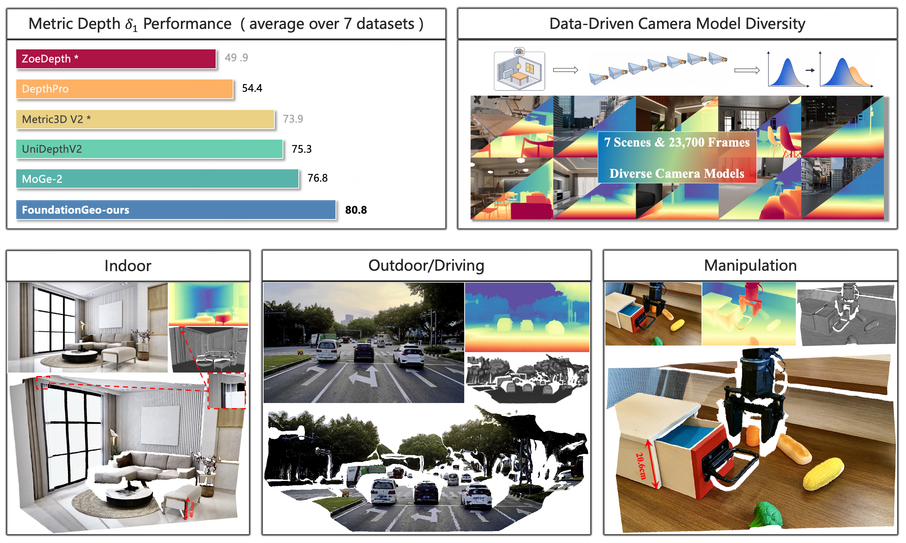
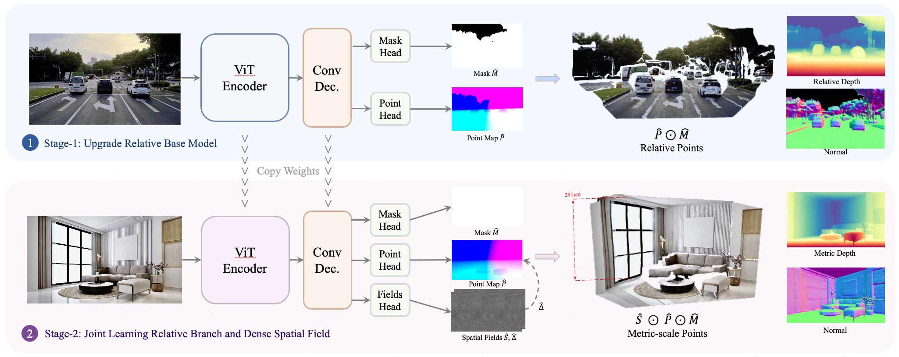
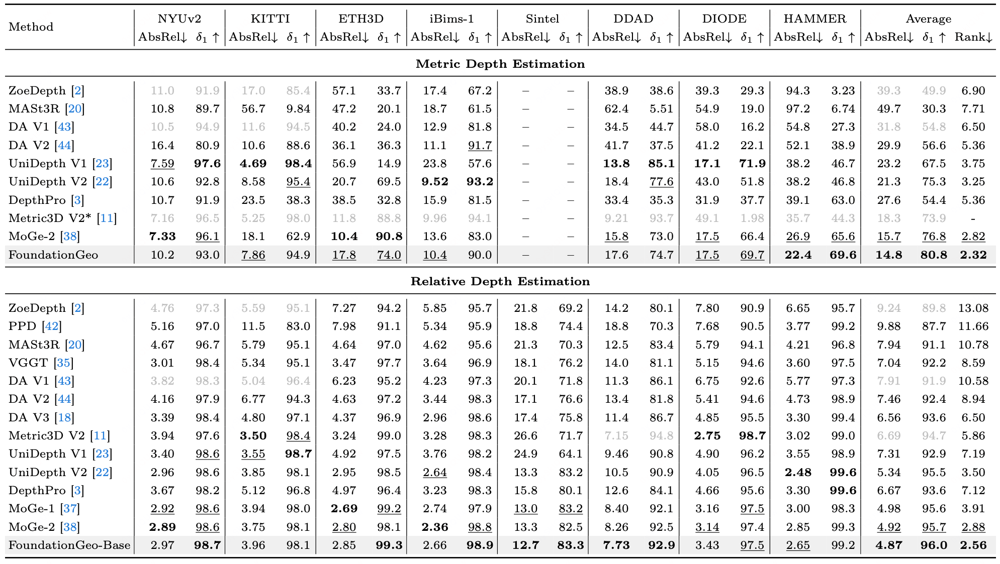

<h1 align="center">FoundationGeo: Learning Pixel-Wise Spatial Fields for Monocular Metric Geometry</h1>

<p align="center">
  <a href="" target="_blank">Muxin Liu<sup>1,2</sup></a><sup>,*</sup>,
  <a href="https://shawlyu.github.io" target="_blank">Xiaoyang Lyu<sup>1,2</sup></a><sup>,*</sup>,
  <a href="https://rentainhe.github.io" target="_blank">Tianhe Ren<sup>1</sup></a>,
  <a href="https://daipengwa.github.io" target="_blank">Peng Dai<sup>1</sup></a>,
  <a href="https://scholar.google.com/citations?user=9nsSKpsAAAAJ&hl=en" target="_blank">Xiaoshan Wu<sup>1,2</sup></a>,
  <a href="" target="_blank">Zhiyue Zhang<sup>1</sup></a>,
  <a href="https://scholar.google.com/citations?user=V1zSNIYAAAAJ&hl=en" target="_blank">Jiaqi Zhang<sup>1</sup></a>,
  <a href="https://jiehonglin.github.io" target="_blank">Jiehong Lin<sup>1</sup></a>,
  <a href="https://shishaoshuai.com" target="_blank">Shaoshuai Shi<sup>2</sup></a><sup>,†</sup>,
  <a href="https://xjqi.github.io" target="_blank">Xiaojuan Qi<sup>1</sup></a><sup>,✉</sup>
</p>

<p align="center">
  <sup>1</sup>HKU CVMI &nbsp;&nbsp;
  <sup>2</sup>Voyager Research, Didi Chuxing
  <br>
  <sup>*</sup>Equal Contribution &nbsp;
  <sup>†</sup>Project Lead &nbsp;
  <sup>✉</sup>Corresponding Author
</p>

<p align="center">
  <a href="https://arxiv.org/abs/2509.20251">
    
  </a>
  <a href="https://mx-liu6.github.io/FoundationGeo-web/">
    
  </a>
  <a href="https://github.com/mx-liu6/FoundationGeo">
    
  </a>
  <a href="https://huggingface.co/your-model">
    
  </a>
</p>

<p align="center">
  
</p>

## TODO

- [ ] Release paper and project page
- [ ] Release Stage-I ViT-L Base model and code
- [ ] Release Stage-II FoundationGeo model and code
- [ ] Release Model Zoo
- [ ] Release training code and config details

## 📝 Abstract

We present **FoundationGeo**, a two-stage framework that explicitly bridges relative and metric prediction via spatial calibration and principled data design. Stage 1 learns a high-fidelity, affine-invariant geometry model by initializing with DINOv3 and training on a curated 10.2M-sample multi-domain corpus with complementary local–detail supervision, yielding sharp boundaries and strong cross-domain generalization. Stage 2 moves beyond global scaling by introducing lightweight pixel-wise calibration fields for metric estimation: a scale field for spatially varying metric alignment and a ray-direction correction field that mitigates directional bias in point-map geometry, together producing metrically consistent 3D point maps.
Beyond model design, we identify camera intrinsic coverage, especially focal length distribution mismatch between training and test data, as a key bottleneck for zero-shot metric generalization: performance drops sharply when test intrinsics fall outside the training distribution. To address this, we synthesize additional training data across diverse focal lengths using a Blender-based data engine, repairing under-covered focal regimes and improving robustness under intrinsic shift.
Extensive zero-shot evaluations across seven benchmarks show that FoundationGeo significantly strengthens cross-domain robustness, staying near the top across diverse domains while avoiding the sharp cross-domain performance drops observed in other methods. This consistency translates into the best overall performance, surpassing heavier baselines by over 5.2% on average.


## 🏗️ Architecture



**FoundationGeo architecture.** A ViT encoder with a lightweight up-sampling convolutional decoder first learns a high-fidelity *relative geometry* branch, predicting a validity mask **M_hat** and an affine-invariant point map **P_hat**. In the second stage, we first apply a ray-direction correction field **Delta_hat** to **P_hat** to obtain a direction-refined relative point map, and then use a spatial scale field **S_hat** to perform spatially varying rescaling, producing a metric point map **P_tilde**. Metric depth and surface normals are subsequently derived from **P_tilde**.

## 📊 Main Results



Quantitative results for metric and relative depth estimation. *AbsRel* and *delta1* are in percentage. The best values are highlighted in **bold**, and the second-best ones are <u>underlined</u>. `*` indicates the model requires GT intrinsics as input. <span style="color: gray;">Gray numbers</span> denote models trained on respective benchmarks or requiring GT intrinsics, and are therefore excluded from ranking.

## 📚 Citation

If you find our work useful, please consider citing:

```bibtex
@article{liu2025foundationgeo,
  title={FoundationGeo: Learning Pixel-Wise Scale Fields for Monocular Metric Geometry},
  author={Liu, Muxin and Lyu, Xiaoyang and Ren, Tianhe and Wu, Xiaoshan and Zhang, Jiaqi and Lin, Jiehong and Shi, Shaoshuai and Qi, Xiaojuan},
  journal={arXiv preprint arXiv:2509.20251},
  year={2025}
}
```

## 🔗 Links

- [Paper](https://arxiv.org/abs/2509.20251)
- [Project Page](https://mx-liu6.github.io/FoundationGeo-web/)
- [Code](https://github.com/mx-liu6/FoundationGeo)
- [Hugging Face](https://huggingface.co/your-model)

## 📄 License

This project is licensed under the MIT License.

## 🙏 Acknowledgments

We thank the MoGe series of works and DINOv3.
